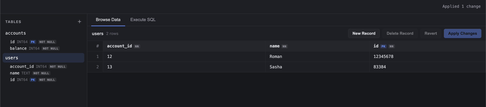

# MyDB (JSDB)

I made this mostly to prove my friend wrong: yes, you can write basically anything in JavaScript.

Almost anything 😂

I also wanted to show that you can embed JS pretty much anywhere. Literally even in your kettle. You just have to love this language enough ❤️

MyDB is a tiny relational database. C++ starts V8 and talks to the OS. The actual database is written in JavaScript. No Node.js in production.

The basic idea is:

```text
Operating system
    ↓
C++ host runtime
    ↓
V8
    ↓
JavaScript database engine
```

It is not trying to beat PostgreSQL or SQLite. I just wanted to build the interesting parts myself and see how far JavaScript could go.

## What is implemented

- Fixed-size 8 KiB pages
- Checksummed database pages and WAL records
- Slotted heap pages and row identifiers
- Clock-based buffer pool
- Binary tuple and catalog formats
- B+Tree primary and secondary indexes
- Write-ahead log with LSNs and durable commits
- Transactions with commit and rollback
- MVCC tuple versions and snapshot visibility
- First-writer-wins conflict detection
- Checkpoints and WAL recovery primitives
- `PRIMARY KEY`, `UNIQUE`, `NOT NULL`, and `FOREIGN KEY`
- `CREATE TABLE`, `DROP TABLE`, `CREATE INDEX`, and `DROP INDEX`
- `INSERT`, `UPDATE`, `DELETE`, and `SELECT`
- `BEGIN`, `COMMIT`, and `ROLLBACK`
- Inner joins, filtering, ordering, and limits
- `COUNT`, `SUM`, `MIN`, `MAX`, and `AVG`
- SQL lexer, parser, binder, logical planner, physical planner, and executor
- Sequential scans and index scans
- `EXPLAIN`
- Interactive shell, metrics, page inspection, and WAL inspection
- Multi-client TCP server with isolated transaction sessions
- Versioned binary protocol with typed row metadata
- Exclusive database-file locking across processes
- Local web UI with SSH port-forwarding support
- Fault injection points, fuzz targets, and benchmarks

The project implements the core machinery needed for ACID behavior:

- Atomicity through explicit transactions, rollback actions, MVCC versions, and WAL transaction records.
- Consistency through schema validation, relational constraints, page invariants, and checksums.
- Isolation through transaction snapshots, MVCC visibility rules, and write-conflict detection.
- Durability through write-ahead logging, `fsync`, page LSNs, checkpoints, and persistent storage.

## Requirements

- A C++20 compiler
- CMake 3.20 or newer
- Ninja
- A compatible V8 build containing headers and either:
  - `v8_monolith`, or
  - `v8`, `v8_libplatform`, and `v8_libbase`

V8 pointer compression and 31-bit Smis are enabled by default because that matches the Homebrew V8 build. If your V8 build uses different settings, pass these CMake options as `OFF`:

```text
MYDB_V8_POINTER_COMPRESSION
MYDB_V8_31BIT_SMIS
```

## Building on macOS

Install the dependencies:

```bash
brew install cmake ninja v8
```

Configure and build:

```bash
cmake -S . -B build -G Ninja \
  -DMYDB_V8_ROOT="$(brew --prefix v8)" \
  -DCMAKE_BUILD_TYPE=Release

cmake --build build
```

Start the shell:

```bash
./build/mydb accounts.db --shell
```

## Building on Linux

Build or install V8, then point `MYDB_V8_ROOT` at a directory containing its `include` and `lib` directories:

```bash
cmake -S . -B build -G Ninja \
  -DMYDB_V8_ROOT=/path/to/v8 \
  -DCMAKE_BUILD_TYPE=Release

cmake --build build
./build/mydb accounts.db --shell
```

## Building on Windows

From PowerShell:

```powershell
cmake -S . -B build -G Ninja `
  -DMYDB_V8_ROOT=C:\path\to\v8 `
  -DCMAKE_BUILD_TYPE=Release

cmake --build build
.\build\mydb.exe accounts.db --shell
```

Use a Windows V8 build whose architecture and build flags match the executable. A macOS or Linux V8 binary cannot be used for the Windows link step.

## Running some SQL

Here is a small transfer between two accounts:

```sql
CREATE TABLE accounts (
    id BIGINT PRIMARY KEY,
    balance BIGINT NOT NULL
);

INSERT INTO accounts VALUES (1, 1000);
INSERT INTO accounts VALUES (2, 1000);

BEGIN;

UPDATE accounts
SET balance = balance - 100
WHERE id = 1;

UPDATE accounts
SET balance = balance + 100
WHERE id = 2;

COMMIT;

SELECT id, balance
FROM accounts
ORDER BY id;
```

The result is:

```text
1 | 900
2 | 1100
```

Exit the shell with:

```text
.quit
```

## Server and UI



Start the database server:

```bash
./build/mydb accounts.db --server 127.0.0.1:7432
```

Start the UI in another terminal:

```bash
npm run ui -- --db-host 127.0.0.1 --db-port 7432
```

Then open `http://127.0.0.1:8080`.

For a database server running on another machine:

```bash
npm run ui -- --ssh user@example.com --remote-port 7432
```

After stopping the database server, open the same file with the embedded shell to check that the data is still there:

```bash
./build/mydb accounts.db --shell
```

```sql
SELECT id, balance FROM accounts ORDER BY id;
```

Useful shell commands:

```text
.tables
.schema
.schema accounts
.stats
.quit
```

## Using the API from Node.js

```js
import { DatabaseConnection } from "./ui/database_connection.js"
import { decodeResult } from "./ui/result.js"

const connection = new DatabaseConnection("127.0.0.1", 7432)

await connection.connect()

const bytes = await connection.query(
  "SELECT id, balance FROM accounts ORDER BY id;"
)

const result = decodeResult(new Uint8Array(bytes))

console.log(result.columns)
console.log(result.rows)

connection.close()
```

Start the database server before running the script:

```bash
./build/mydb name.db --server 127.0.0.1:7432
```

## Tests

The JavaScript engine and storage tests use a small Node.js host adapter so they can run quickly without rebuilding the embedded runtime:

```bash
npm test
```

The current suite covers binary formats, page persistence, corruption detection, buffer eviction, B+Tree properties, WAL records, recovery primitives, MVCC visibility, rollback, constraints, indexes, joins, aggregates, planning, and persistence across restart.

## Benchmarks

These numbers are from one Apple Silicon machine using a Release build and Node.js 24 for the benchmark host. Each result is the median of five runs. They are just a local reference, not a universal score. Storage hardware, V8 version, filesystem behavior, and background load all matter.

The suite used 2,000 rows unless another count is shown:

| Workload | Result |
| --- | ---: |
| B+Tree insert, 100,000 entries | 3,956,003 ops/s |
| B+Tree lookup, 100,000 entries | 3,802,974 ops/s |
| Bulk insert in one transaction | 16,034 ops/s |
| Indexed point read | 121,604 ops/s |
| Indexed point reads in one transaction | 175,490 ops/s |
| Sequential predicate scan | 4,292 ops/s |
| Bounded range query | 21,637 ops/s |
| Aggregate scan | 3,086 ops/s |
| Transactional update | 5,620 ops/s |
| Autocommit write | 182 commits/s |
| Commit latency p50 | 5.871 ms |
| Commit latency p95 | 6.990 ms |
| Commit latency p99 | 7.083 ms |
| Checkpoint | 5.385 ms |
| Reopen database | 56.920 ms |
| First indexed read after reopen | 5.441 ms |

Read-only queries do not write to the WAL or call `fsync`. Keeping a batch inside one explicit transaction is still faster because it also avoids setting up a new snapshot for every query.

Run the benchmarks with:

```bash
npm run benchmark:btree -- 100000
npm run benchmark:database -- 2000
npm run benchmark:suite -- 2000
```

So yeah. JavaScript in a database today, JavaScript in a kettle tomorrow ❤️
